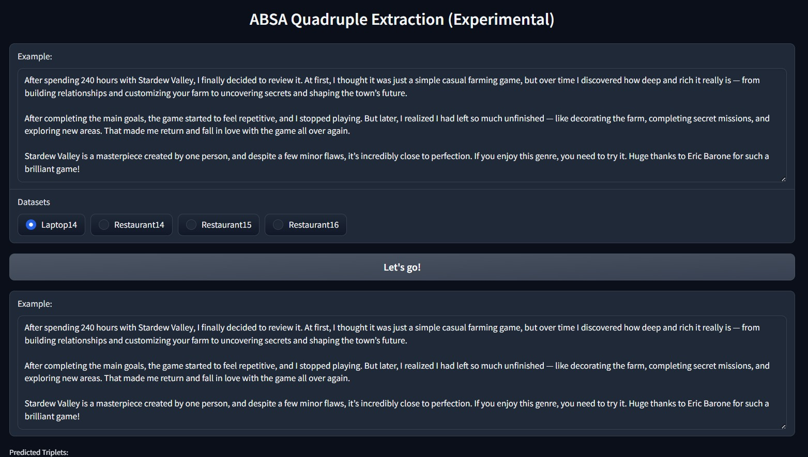
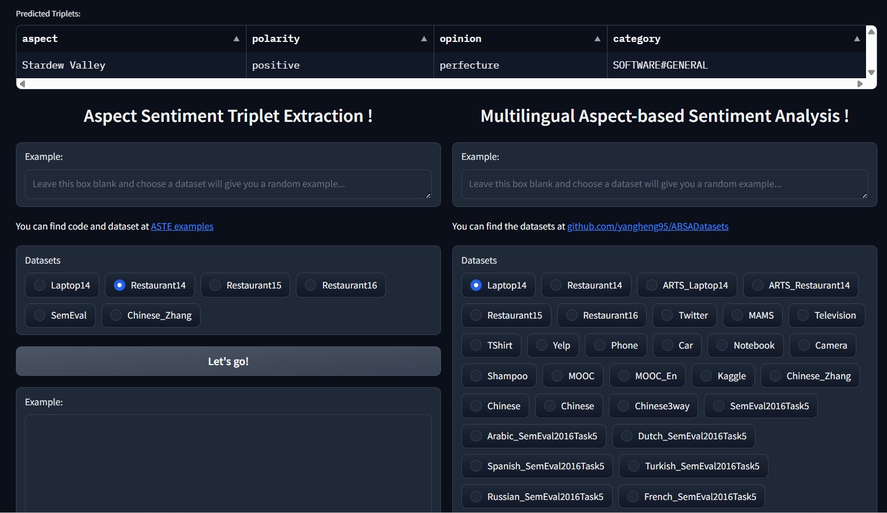

# Testing-Language-analyzing
I used a review on Steam of the game Stardew Valley. The software I used recognized some analysis and sentiment.

This small test experience opened my mind to some new ideas, like interpreting chat to monitor the general mood, and so on.